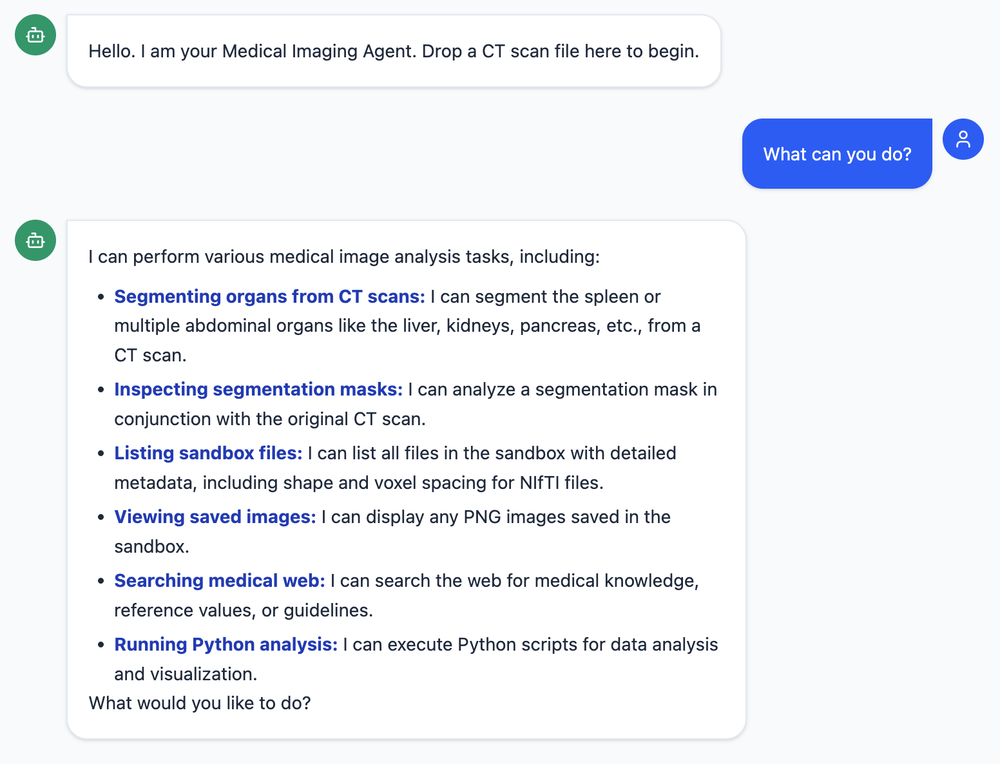

# Medical Imaging Agent

An interactive medical imaging assistant that runs MONAI segmentation models, analyzes NIfTI masks, and lets you chat with an LLM-backed agent over a web UI (FastAPI + React). Everything reads/writes inside a sandbox so uploads, masks, and generated visuals stay contained.



## Features
- 13-organ abdominal segmentation (Swin-UNETR) and spleen segmentation via MONAI bundles.
- Mask analysis: per-organ volumes (voxel spacing aware) and HU stats; auto-generates a representative slice overlay as PNG.
- Inline image display in chat; sandboxed file upload and listing.
- Web search (DuckDuckGo), and sandboxed Python execution for custom plots/analysis.
- React + Tailwind chat UI with streaming responses and drag/drop uploads.

## Project Layout
- `src/backend/`: FastAPI app (`main.py`) exposing `/chat`, `/upload`, `/image/{filename}`, `/reset`.
- `src/frontend/`: React (Vite) + Tailwind UI (`Chat.jsx`).
- `src/tools/`: model loading (`inference.py`), analysis (`analysis.py`), tool wrappers (`defenitions.py`).
- `conf/config.yaml`: Hydra config (LLM, models, sandbox path, device).
- `sandbox/`: working directory for uploads, masks, generated PNGs (kept out of Git).

## Prerequisites
- Python 3.10+ with MONAI, FastAPI, Uvicorn, Google Gemini SDK, nibabel, numpy, matplotlib.
- Node 18+ for the frontend.
- Environment: `GEMINI_API_KEY` set; `conf/config.yaml` points `sandbox.path` to a writable folder and lists active bundles.
- Models: download MONAI bundles into `models/` (e.g., `swin_unetr_btcv_segmentation`, `spleen_ct_segmentation`); large weights are not tracked in Git.

## Running Locally
1. Backend
   ```bash
   export GEMINI_API_KEY=your_key
   uvicorn src.backend.main:app --reload --host 0.0.0.0 --port 8000
   ```
2. Frontend
   ```bash
   cd src/frontend
   npm install
   npm run dev -- --host --port 5173
   ```
3. Access the UI at the reported URL (default http://localhost:5173).

## Using the Agent
- Upload scans/masks via drag/drop; files are saved to the sandbox. Refer to them by sandbox-relative names (e.g., `Spleen/spleen.nii.gz`).
- Ask for segmentation, analysis, or to view a saved PNG (e.g., `vis_spleen_seg.png` or any plot you generate).
- Generated images are shown inline; metrics are returned as structured JSON and rendered in chat.

## Notes
- `.gitignore` excludes models, data, sandbox contents, and build artifacts.
- Code execution runs as a subprocess in the sandbox (same Python environment); use `plt.savefig(...)` to produce images the agent can display.
